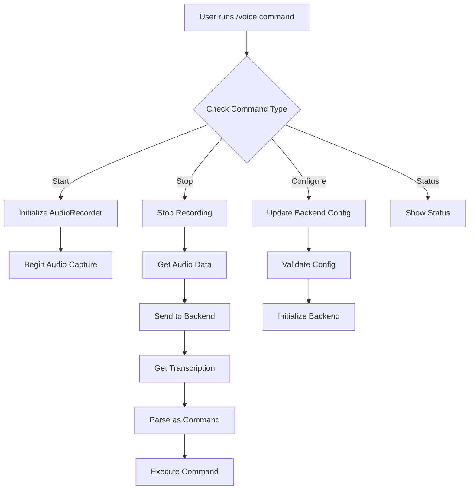

- Feature Name: `voice-chat`
- Start Date: 2025-04-16

# Summary

[summary]: #summary

Add a `/voice` command to the Amazon Q Developer CLI that allows developers to interact with the CLI using an opt-in voice input feature. Audio is recorded, transcribed using a user-configured backend (e.g. [Whisper](https://github.com/openai/whisper) local model, [hosted Whisper model in AWS SageMaker](https://aws.amazon.com/blogs/machine-learning/host-the-whisper-model-on-amazon-sagemaker-exploring-inference-options/), Amazon Transcribe, etc.), and passed to the existing command pipeline.

# Motivation

[motivation]: #motivation

This proposal introduces support for voice input via locally hosted or cloud-hosted transcription models in order to improve the speed and flexibility of command entry within the system. 

The current text-only input system presents several limitations in various use cases, such as:

* When developers need hands-free coding capabilities that simulate collaborative programming sessions
* For users requiring enhanced accessibility options
* In situations where verbal communication proves more efficient and natural for workflow commands

The `/voice` command addresses these issues by providing:
1. A versatile integration framework that supports multiple transcription services, whether deployed locally or in the cloud
2. A flexible configuration system allowing seamless switching between different transcription engines without modifying the core application code
3. A transparent, permission-based approach that prioritizes user consent and system clarity

This feature is inspired by Aider's [voice to code feature](https://aider.chat/docs/usage/voice.html).

This feature also adds the plumbing necessary for future multi-modal interaction, enabling scenarios such as:


```bash
# Start a chat session
$ q chat

> "Analyze this design meeting recording, and provide key points, decisions, and action items" \
  --input ~/meetings/team-sync.mp3
```

# Guide-level explanation

[guide-level-explanation]: #guide-level-explanation

Users can type `/voice` during a chat session to trigger the voice input capture process. This command will:

1. Initiate a recording session, if voice input has been configured and enabled
2. Audio is captured, held in memory, and passed to a configured transcription backend (local or remote)
3. The backend returns a text transcription, which is executed as if typed manually

## Configuration

Users can define the transcription backend and its parameters ina TOML configuration file located at a default path (e.g. `.amazonq/config/voice.toml`), inline, or via environment variable(s).

Configuration file example:
```toml
[voice]
enabled = true
engine = "whisper" // Options include whisper for local, AWS Transcribe for remote, etc
model_path = "<path to whisper model>"
language = "en-US"
```

When a configuration file is not present, the system falls back to environment variables. For example:

```
VOICE_ENGINE=aws_transcribe
AWS_REGION=us-west-2
AWS_LANGUAGE=en-US
```

If specified inline using `/voice` command options, the specified configuration will take precedence:

```
$ q chat 
> /voice --engine=whisper --model-path=/path/to/model
```

## Example interactions

Basic interaction:


```bash
# Start a chat session
$ q chat

# Basic voice commands within the chat session
> /voice                    # Shows help/usage information
> /voice start             # Starts voice recording
> /voice stop              # Stops recording and processes the command
> /voice status            # Shows current voice settings and state
> /voice help              # Displays detailed help information
```

Specifying a voice backend inline example:

```bash
$ q chat
> /voice configure --engine whisper      # Configure to use local Whisper
> /voice configure --engine transcribe   # Configure to use AWS Transcribe
> /voice configure --engine sagemaker    # Configure to use SageMaker endpoint
```

Interactive usage example

```bash
$ q chat
Hi, I'm Amazon Q. Ask me anything.

Things to try
• Fix the build failures in this project.
• List my s3 buckets in us-west-2.
• Write unit tests for my application.
• Help me understand my git status.

/tools        View and manage tools and permissions
/issue        Report an issue or make a feature request
/profile      (Beta) Manage profiles for the chat session
/context      (Beta) Manage context files for a profile
/compact      Summarize the conversation to free up context space
/help         Show the help dialogue
/quit         Quit the application

Use Ctrl(^) + j to provide multi-line prompts.

> /voice start
🎤 Recording started... (speak your command)
[Recording in progress...]
(User speaks: "Create a new Lambda function")
> /voice stop # To explicitly stop, otherwise will stop automatically based on duration setting
✓ Recording stopped
✍️ Transcribing...
✓ Transcribed: "Create a new Lambda function"
Processing command...
[Lambda function creation workflow starts...]
```

Status check example:

```bash
> /voice status
Voice System Status:
• 🎙️ Recording: Not active
• 🚀 Current Engine: AWS Transcribe
• 📊 Sample Rate: 16000 Hz
• 🌐 Language: en-US
• ⏱️ Max Duration: 15 seconds
• 🐛 Debug Mode: Off
```

Debug options:
```bash
> /voice start --save-audio        # Saves audio file for debugging
> /voice start --save-transcript   # Saves transcript for debugging
> /voice start --debug            # Enables verbose logging
```

Advanced usage:
```
> /voice start --max-duration 30   # Set custom recording duration which stops the recording session automatically
> /voice start --prompt "Act as a developer"  # Add context to transcription
```

Visual feedback:
```
> /voice start
🎤 Recording... [Press Enter or use '/voice stop' to stop]
[▓▓▓▓▓▓▓▓▓▓▓▓▓▓▓▓▓▓▓▓] 15s
✓ Recording complete
✍️ Transcribing...
✓ Command: "create a new S3 bucket called test-bucket"
Processing...
```

Error handling:
```
> /voice start
❌ Error: Voice feature not enabled. 
To enable, add to ~/.amazonq/config/voice.toml:
[voice]
enabled = true
backend = "whisper" # requires a local whisper model
model-path = "path/to/your/model"

> /voice configure --backend invalid
❌ Error: Invalid backend type. Available options: whisper, transcribe, sagemaker

> /voice start
❌ Error: No microphone detected. Please check your audio settings.
```

Help:
```
> /voice help
Voice Command Interface

Commands:
  start                    Start voice recording session
  stop                     Stop current recording
  status                   Show voice settings
  configure                Configure voice backend
  help                     Show this help message

Options:
  --engine <type>         Set transcription backend (whisper/transcribe/sagemaker)
  --max-duration <secs>    Maximum recording duration (default: 15)
  --save-audio            Save audio file for debugging
  --save-transcript       Save transcript for debugging
  --debug                 Enable verbose logging

Examples:
  /voice start            Start recording
  /voice configure --backend whisper
  /voice status
```

## Options 

The `/voice` command supports optional parameters:

| Option             | Type     | Description                                                                                  | Required | Default                      |
|--------------------|----------|----------------------------------------------------------------------------------------------|----------|------------------------------|
| `--engine`        | string   | Selects the transcription backend: `whisper`, `sagemaker`, or `transcribe`                  | No       | None  |
| `--language-code`  | string   | Language code (e.g. `en-US`) for services like Transcribe                                   | No       | `en-US`                      |
| `--sample-rate`    | integer  | Sample rate of audio in Hz (only for Transcribe and some SageMaker models)                 | No       | `16000`                      |
| `--model-path`     | path     | Filesystem path to local Whisper model                                                      | No       | None                |
| `--endpoint-name`  | string   | SageMaker endpoint name for custom model inference                                          | No       | None                  |
| `--region`         | string   | AWS region for SageMaker or Transcribe                                                      | No       | None                |
| `--save-audio`     | flag     | If specified, saves the recorded audio locally for debugging                                | No       | Disabled              
| `--save-transcript`     | flag     | If specified, saves the audio transcript locally for debugging                                | No       | Disabled       |
| `--max-duration`   | integer  | Maximum voice recording duration in seconds                                                 | No       | `15`                         |
| `--prompt`         | string   | Optional prompt prefix that gets prepended to transcribed input (e.g. "Act as a developer") | No       | None                         |
| `--debug`          | flag     | Enables verbose logging of transcription steps                                              | No       | Disabled            
## Security and Privacy

- **Opt-in only**: Voice mode must be explicitly enabled in configuration.
- **In-memory processing**: Audio and text are never written to disk, unless explicitly directed by the user to save audio through the option `--save-audio` or `--save-transcript`
- **Encrypted communication**: Required for cloud-based services like SageMaker or Transcribe.

# Reference-level explanation

[reference-level-explanation]: #reference-level-explanation

The `/voice` command will be integrated into the existing chat module structure in `q_cli/src/cli/chat/`, specifically:

1. Enum additions

```rust
#[derive(Debug, Clone, PartialEq, Eq)]
pub enum VoiceBackend {
    Whisper,
    SageMaker,
    Transcribe,
}

#[derive(Debug, Clone, PartialEq, Eq)]
pub enum VoiceSubcommand {
    Start,
    Stop,
    Configure { backend: VoiceBackend },
    Status,
    Help,
}

// Add to Command enum
#[derive(Debug, PartialEq, Eq)]
pub enum Command {
    // ... existing variants ...
    Voice {
        subcommand: Option<VoiceSubcommand>,
    },
}
```

2. Implementation for VoiceSubcommand

```rust
impl VoiceSubcommand {
    const AVAILABLE_COMMANDS: &str = color_print::cstr! {"<cyan!>Available commands</cyan!>
  <em>help</em>                    <black!>Show voice command help</black!>
  <em>start</em>                   <black!>Start voice recording session</black!>
  <em>stop</em>                    <black!>Stop current voice recording session</black!>
  <em>configure --backend <type></em>    <black!>Configure voice backend (whisper/sagemaker/transcribe)</black!>
  <em>status</em>                  <black!>Display current voice settings</black!>"};

    const CONFIGURE_USAGE: &str = "/voice configure --backend <backend_type>";
    
    fn usage_msg(header: impl AsRef<str>) -> String {
        format!("{}\n\n{}", header.as_ref(), Self::AVAILABLE_COMMANDS)
    }

    pub fn help_text() -> String {
        color_print::cformat!(
            r#"
<magenta,em>Voice Command Interface</magenta,em>

Use voice commands to interact with Amazon Q CLI through speech.
Voice input is processed securely with no persistent storage.

{}

<cyan!>Notes</cyan!>
• Voice feature is opt-in and must be enabled in configuration
• No audio data is stored on disk
• Supports multiple transcription backends
• All communication is encrypted
"#,
            Self::AVAILABLE_COMMANDS
        )
    }
}
```

3. Command parsing updates

```rust
impl Command {
    pub fn parse(input: &str, output: &mut impl Write) -> Result<Self, String> {
        // ... existing match arms ...
        
        return Ok(match parts[0].to_lowercase().as_str() {
            // ... existing matches ...
            
            "voice" => {
                if parts.len() < 2 {
                    return Ok(Self::Voice { subcommand: None });
                }

                match parts[1].to_lowercase().as_str() {
                    "start" => Self::Voice {
                        subcommand: Some(VoiceSubcommand::Start),
                    },
                    "stop" => Self::Voice {
                        subcommand: Some(VoiceSubcommand::Stop),
                    },
                    "status" => Self::Voice {
                        subcommand: Some(VoiceSubcommand::Status),
                    },
                    "configure" => {
                        // Parse configure arguments
                        let mut backend = None;
                        let mut i = 2;
                        while i < parts.len() {
                            match parts[i] {
                                "--engine" => {
                                    if let Some(backend_str) = parts.get(i + 1) {
                                        backend = Some(match backend_str.to_lowercase().as_str() {
                                            "whisper" => VoiceBackend::Whisper,
                                            "sagemaker" => VoiceBackend::SageMaker,
                                            "transcribe" => VoiceBackend::Transcribe,
                                            _ => return Err(format!("Invalid backend type: {}", backend_str)),
                                        });
                                        i += 2;
                                    } else {
                                        return Err(format!(
                                            "Missing backend type.\n\nUsage:\n  {}",
                                            VoiceSubcommand::CONFIGURE_USAGE
                                        ));
                                    }
                                }
                                _ => {
                                    return Err(format!(
                                        "Invalid configure argument.\n\nUsage:\n  {}",
                                        VoiceSubcommand::CONFIGURE_USAGE
                                    ));
                                }
                            }
                        }

                        if let Some(backend) = backend {
                            Self::Voice {
                                subcommand: Some(VoiceSubcommand::Configure { backend }),
                            }
                        } else {
                            return Err(format!(
                                "Missing --backend argument.\n\nUsage:\n  {}",
                                VoiceSubcommand::CONFIGURE_USAGE
                            ));
                        }
                    },
                    "help" => Self::Voice {
                        subcommand: Some(VoiceSubcommand::Help),
                    },
                    other => {
                        return Err(VoiceSubcommand::usage_msg(
                            format!("Unknown subcommand '{}'.", other)
                        ));
                    }
                }
            },
            // ... rest of the match arms ...
        });
    }
}
```

4. Implementation for transcription backends

```rust
use async_trait::async_trait;
use eyre::Result;
use tokio;
use std::sync::Arc;

// 1. Trait for transcription backends
#[async_trait]
trait TranscriptionBackend: Send + Sync {
    async fn transcribe(&self, audio_data: Vec<u8>) -> Result<String>;
    fn name(&self) -> &'static str;
}


// 2. Implementation for each backend
// Whisper Backend
struct WhisperBackend;
#[async_trait]
impl TranscriptionBackend for WhisperBackend {
    async fn transcribe(&self, audio_data: Vec<u8>) -> Result<String> {
        // Implementation details for local Whisper model
    }
    fn name(&self) -> &'static str { "whisper" }
}

// AWS Transcribe Backend
struct TranscribeBackend {
    client: aws_sdk_transcribe::Client,
}
#[async_trait]
impl TranscriptionBackend for TranscribeBackend {
    async fn transcribe(&self, audio_data: Vec<u8>) -> Result<String> {
        let response = self.client
            .start_stream_transcription()
            .media_encoding("pcm")
            .language_code("en-US")
            .media_sample_rate_hertz(16000)
            .send()
            .await?;
        // Process response
    }
    fn name(&self) -> &'static str { "transcribe" }
}


// 3. Audio recording handler
struct AudioRecorder {
    is_recording: bool,
    sample_rate: u32,
    channels: u16,
}

impl AudioRecorder {
    fn new() -> Self {
        Self {
            is_recording: false,
            sample_rate: 16000,
            channels: 1,
        }
    }

    async fn start_recording(&mut self) -> Result<()> {
        use cpal::traits::{DeviceTrait, HostTrait, StreamTrait};
        
        // Audio recording implementation
        todo!("Implement audio recording")
    }

    async fn stop_recording(&mut self) -> Result<Vec<u8>> {
        // Stop recording and return audio data
        todo!("Implement stop recording")
    }
}

// 4. Voice command handler
struct VoiceHandler {
    recorder: AudioRecorder,
    backend: Arc<dyn TranscriptionBackend>,
}

impl VoiceHandler {
    fn new(backend: VoiceBackend) -> Result<Self> {
        let backend: Arc<dyn TranscriptionBackend> = match backend {
            VoiceBackend::Whisper => Arc::new(WhisperBackend),
            VoiceBackend::Transcribe => {
                let config = aws_config::load_from_env().await?;
                let client = aws_sdk_transcribe::Client::new(&config);
                Arc::new(TranscribeBackend { client })
            },
            VoiceBackend::SageMaker => {
                // Initialize SageMaker client
                todo!("Implement SageMaker backend")
            }
        };

        Ok(Self {
            recorder: AudioRecorder::new(),
            backend,
        })
    }

    async fn handle_command(&mut self, subcommand: Option<VoiceSubcommand>) -> Result<()> {
        match subcommand {
            Some(VoiceSubcommand::Start) => {
                println!("Starting voice recording...");
                self.recorder.start_recording().await?;
            }
            Some(VoiceSubcommand::Stop) => {
                if self.recorder.is_recording {
                    println!("Stopping recording and transcribing...");
                    let audio_data = self.recorder.stop_recording().await?;
                    
                    // Transcribe the audio
                    let text = self.backend.transcribe(audio_data).await?;
                    
                    // Process the transcribed text as a command
                    println!("Transcribed text: {}", text);
                    
                    // Handle the transcribed command
                    if let Ok(command) = Command::parse(&text, &mut std::io::stdout()) {
                        // Execute the transcribed command
                        // You'll need to implement this based on your command execution logic
                        execute_command(command).await?;
                    }
                }
            }
            Some(VoiceSubcommand::Configure { backend }) => {
                // Update the transcription backend
                *self = Self::new(backend)?;
                println!("Configured voice backend: {:?}", backend);
            }
            Some(VoiceSubcommand::Status) => {
                println!("Voice Status:");
                println!("Recording: {}", self.recorder.is_recording);
                println!("Backend: {}", self.backend.name());
                println!("Sample Rate: {} Hz", self.recorder.sample_rate);
                println!("Channels: {}", self.recorder.channels);
            }
            Some(VoiceSubcommand::Help) => {
                println!("{}", VoiceSubcommand::help_text());
            }
            None => {
                println!("{}", VoiceSubcommand::help_text());
            }
        }
        Ok(())
    }
}

// 5. Integration with Command enum
impl Command {
    pub async fn execute(&self) -> Result<()> {
        match self {
            Command::Voice { subcommand } => {
                // Get the configured backend from settings
                let config = load_voice_config()?;
                let mut handler = VoiceHandler::new(config.backend)?;
                handler.handle_command(subcommand.clone()).await?;
            }
            // ... other command handlers ...
        }
        Ok(())
    }
}

// 6. Configuration structure
#[derive(Deserialize)]
struct VoiceConfig {
    backend: VoiceBackend,
    sample_rate: u32,
    channels: u16,
    language_code: String,
    max_duration: u32,
    save_debug_info: bool,
}

fn load_voice_config() -> Result<VoiceConfig> {
    // Load configuration from file or environment
    todo!("Implement configuration loading")
}

// 7. Error handling
#[derive(Debug, thiserror::Error)]
enum VoiceError {
    #[error("Audio recording error: {0}")]
    RecordingError(String),
    
    #[error("Transcription error: {0}")]
    TranscriptionError(String),
    
    #[error("Backend configuration error: {0}")]
    ConfigurationError(String),
    
    #[error("Invalid audio format: {0}")]
    AudioFormatError(String),
    
    #[error("Backend initialization failed: {0}")]
    BackendInitError(String),
    
    #[error("Command execution error: {0}")]
    CommandError(String),
}

// 8. Security considerations
```rust
// Security implementations
impl VoiceHandler {
    fn validate_audio_data(&self, data: &[u8]) -> Result<()> {
        // Validate audio format and size
        // Check for potential security issues
    }

    fn cleanup(&mut self) {
        // Ensure all sensitive data is cleared
        // Reset state
    }
}

impl Drop for VoiceHandler {
    fn drop(&mut self) {
        self.cleanup();
    }
}
```

Usage examples:
```rust
// Usage example:
// Configuration example
let config = VoiceConfig {
    backend: VoiceBackend::Whisper,
    sample_rate: 16000,
    channels: 1,
    language_code: "en-US".to_string(),
    max_duration: 15,
    save_debug_info: false,
};

// Command usage examples
async fn voice_examples() -> Result<()> {
    // Start recording
    let cmd = Command::Voice { 
        subcommand: Some(VoiceSubcommand::Start) 
    };
    cmd.execute().await?;

    // Configure backend
    let cmd = Command::Voice { 
        subcommand: Some(VoiceSubcommand::Configure { 
            backend: VoiceBackend::Transcribe 
        })
    };
    cmd.execute().await?;

    // Check status
    let cmd = Command::Voice { 
        subcommand: Some(VoiceSubcommand::Status) 
    };
    cmd.execute().await?;

    Ok(())
}

```


Diagram:



# Drawbacks

[drawbacks]: #drawbacks

1. **Increased complexity**: Adds non-trivial complexity to the CLI, i.e. audio recording, transcription orchestration, configuration layers, and additional error handling scenarios.
2. **User confusion**: Requires the user to configure and set up transcription engines, as this is not an out-of-the-box feature.
3. **Latency**: Transcription introduces a delay in command processing and response, especially by adding cloud-based backends (e.g. Amazon Transcribe, SageMaker).


# Rationale and alternatives

[rationale-and-alternatives]: #rationale-and-alternatives
1. **Natural extension of Amazon Q's chat capabilities**: Amazon Q is already a conversational assistant with agentic capabilities. Voice input is a logical, modern extension of its design and already present in similar products.
2. **Modular and configurable**: This RFC proposes a trait-based architecture with clear backend separation. It allows the community to add their own speech-to-text backends based on their own requirements.
3. **Privacy by design**: This feature is disabled by default, requiring explicit opt-in and configuration.

## Alternatives considered
1. **Typed input only (status quo)**
2. **Use AWS Transcribe only**: Simpler to implement. However, this ties the `/voice` command to a paid AWS service.
3. **Local whisper only**: Fully private and offline. However, this requires model downloads and compute capability and is not viable for all environments.
4. **External voice app**: Let users use external voice capture tools (e.g. macOS dictation) to feed into the CLI. However, this lacks integration and control over UX and context.

## Impact of not doing this
- Missed opportunity to differentiate Amazon Q CLI from other AI dev tools
- Leaves out accessibility enhancements and voice-centric workflows
- Forfeits long-term positioning as a multi-modal agentic assistant


# Unresolved questions

[unresolved-questions]: #unresolved-questions

1. Audio processing
   1. What is the optimal buffer size for audio processing to balance latency and accuracy?
   2. How do we handle different microphone configurations and quality levels? (or is this even an issue?)
2. Backend selection
   1. What criteria should determine the default backend selection? Should it just be None, and let the user define?
   2. Should we implement automatic fallback between backends if one fails? For example, if specified AWS Transcribe *and* Whisper is installed locally, could we fallback automatically?
3. Performance considerations
   1. What are the memory implications of holding audio data in memory?
   2. How do we handle long-running transcription requests? Should we set a maximum allowable duration?
   3. What are the timeout thresholds for different operations and, especially, remote services?
4. Security
   1. How do we handle sensitive information in transcribed text?
5. Configuration management
   1. This RFC is predicated on configuration changes that can persist across sessions, from a configuration file or environment variables. Is that the right approach?
   2. How do we handle configuration conflicts between local and global settings? Or precedence of inline vs. environment variable vs. configuration file

# Future possibilities

[future-possibilities]: #future-possibilities

1. Enhanced voice features
   1. Background noise reduction and audio preprocessing
   2. Support for multiple simultaneous audio inputs
   3. Conversation mode (i.e. Amazon Q *speaks back*)
   4. Custom wake words for hands-free activation
   5. Real-time transcription preview during recording
2. Backend integrations
   1. Hybrid backend approach using multiple services for improved accuracy
   2. Support for additional cloud providers' speech-to-text services
   3. Integration with custom enterprise speech recognition systems
3. Command processing
   1. Natural language understanding for complex command interpretation
   2. Context-aware command suggestions based on voice input
   3. Command chaining and macro support through voice
   4. Automatic correction of common voice command mistakes
4. Accessibility
   1. Can we make this *entirely* hands free?
   2. Support for multiple languages and accents? Support would be based on backends configured and their own limitations.
   3. Customizable voice feedback and confirmation sounds
   4. Integration with screen readers and accessibility tools
5. Performance optimizations
   1. Streaming transcription, when possible, for reduced latency
   2. Optimized audio compression for cloud services
   3. Local processing optimizations for Whisper backend
